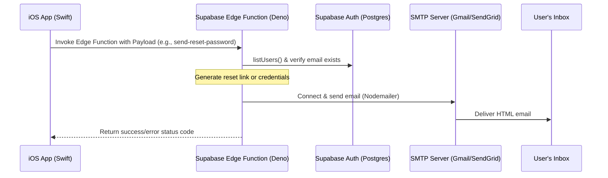

# Implementation Plan: Email OTP System for PawPing (Supabase + Swift)

This document studies the email-sending mechanism currently implemented in **Project_RSMS** and outlines a technical plan to implement **Forgot Password OTP** and **Email Verification OTP** in the **PawPing** app.

---

## Part 1: How it Works in Project_RSMS

In Project_RSMS, email communication bypasses standard Supabase limits and leverages a custom SMTP server (e.g., Gmail SMTP) via **Supabase Deno Edge Functions** and the **Nodemailer** npm package.

### Architecture Flowchart


### Key Components Analyzed

1. **Client-Side Trigger (`AuthManager.swift` & `CredentialAssignmentViewModel.swift`)**:
   - The iOS app uses the Supabase Swift library to call functions:
     ```swift
     try await supabaseClient.functions.invoke(
         "send-reset-password",
         options: FunctionInvokeOptions(body: ResetPayload(email: email))
     )
     ```
2. **Edge Function (`supabase/functions/send-reset-password/index.ts`)**:
   - Written in TypeScript for Deno.
   - Initializes a high-privilege `supabaseAdmin` client using the `SUPABASE_SERVICE_ROLE_KEY` to query Auth metadata.
   - Connects to an external SMTP server using Deno's NPM support to import `nodemailer`:
     ```ts
     import { createTransport } from "npm:nodemailer@6.9.8";
     ```
   - Loads SMTP credentials from Deno environment secrets (`SMTP_HOST`, `SMTP_PORT`, `SMTP_USER`, `SMTP_PASS`).
   - Generates a recovery link using `supabaseAdmin.auth.admin.generateLink({ type: "recovery", ... })`.
   - Sends a modern, responsive HTML email to the user.

---

## Part 2: Implementation Plan for PawPing

To implement the two requested flows in **PawPing**:
1. **Forgot Password OTP**: Sends a 6-digit OTP to the user's email if it is registered in the database, allowing them to verify and set a new password.
2. **Sign Up Verification OTP**: Sends a 6-digit OTP to a new user's email to verify their account before activation.

We present two approaches. **Option A** is the recommended native approach (simpler, highly secure, zero Edge Function maintenance), while **Option B** mimics Project_RSMS's custom Edge Function setup (gives complete control over HTML templates and custom validation).

---

### Option A: Native Supabase Auth OTP (Recommended)
This approach configures Supabase Auth to send 6-digit OTPs using a custom SMTP server, managed directly by Supabase's native auth configuration.

#### 1. Supabase Dashboard Settings
1. Go to **Project Settings > Auth**.
2. **SMTP Configuration**:
   - Turn **ON** "Enable SMTP".
   - Enter your SMTP details (e.g., SMTP host: `smtp.gmail.com`, Port: `587`, Sender email, Username, and Password).
3. **Email Templates**:
   - **Confirm Signup**: Modify the template to show the OTP. Use the placeholder `{{ .Token }}` instead of `{{ .ConfirmationURL }}`.
     *Example message: "Your verification code is: `{{ .Token }}`"*
   - **Reset Password**: Modify the template to show the OTP. Use the placeholder `{{ .Token }}`.
     *Example message: "Your password reset code is: `{{ .Token }}`"*

#### 2. iOS Client Swift Code (PawPing)
You can directly call Supabase's built-in OTP verification APIs.

```swift
import Supabase
import Foundation

class AuthViewModel: ObservableObject {
    let client: SupabaseClient
    
    init(client: SupabaseClient) {
        self.client = client
    }
    
    // MARK: - Sign Up Verification
    
    /// Step 1: Create the account. This automatically triggers Supabase to send a signup OTP.
    func signUp(email: String, password: String) async throws {
        try await client.auth.signUp(email: email, password: password)
    }
    
    /// Step 2: User enters the 6-digit code from their email.
    func verifySignUpOTP(email: String, code: String) async throws {
        try await client.auth.verifyOTP(
            email: email,
            token: code,
            type: .signup
        )
    }
    
    // MARK: - Forgot Password Flow
    
    /// Step 1: Requests a password reset. Supabase automatically verifies if the email exists
    /// (returns silent success or explicit error based on your Auth dashboard security settings).
    func requestPasswordReset(email: String) async throws {
        try await client.auth.resetPasswordForEmail(email)
    }
    
    /// Step 2: User enters the 6-digit code. This logs the user in temporarily with a recovery session.
    func verifyResetOTP(email: String, code: String) async throws {
        try await client.auth.verifyOTP(
            email: email,
            token: code,
            type: .recovery
        )
    }
    
    /// Step 3: Once verified, prompt the user for their new password.
    func updatePassword(newPassword: String) async throws {
        try await client.auth.update(
            user: UserAttributes(password: newPassword)
        )
    }
}
```

---

### Option B: Custom Edge Functions with SMTP (Project_RSMS Style)
Use this if you want to send highly customized HTML emails or perform custom validation (e.g. check user tables before triggering anything).

#### 1. Database Table Setup (`supabase/migrations`)
Create a table to track sent OTP codes:
```sql
create table public.otp_verifications (
  id uuid default gen_random_uuid() primary key,
  email text not null,
  otp_code varchar(6) not null,
  purpose text not null check (purpose in ('signup', 'reset')),
  expires_at timestamp with time zone not null,
  is_verified boolean default false,
  created_at timestamp with time zone default timezone('utc'::text, now()) not null
);

-- Enable RLS and block read/write from public client (only allow from service_role / Edge Function)
alter table public.otp_verifications enable row level security;
```

#### 2. Supabase Edge Function (`supabase/functions/send-otp/index.ts`)
Create a custom Deno function to generate and send custom OTPs:

```ts
import { serve } from "https://deno.land/std@0.177.0/http/server.ts";
import { createClient } from "https://esm.sh/@supabase/supabase-js@2.45.6";
import { createTransport } from "npm:nodemailer@6.9.8";

const corsHeaders = {
  "Access-Control-Allow-Origin": "*",
  "Access-Control-Allow-Headers": "authorization, x-client-info, apikey, content-type",
};

serve(async (req: Request) => {
  if (req.method === "OPTIONS") return new Response("ok", { headers: corsHeaders });

  try {
    const { email, purpose } = await req.json(); // purpose = 'signup' | 'reset'

    if (!email || !purpose) {
      return new Response(JSON.stringify({ error: "Missing email or purpose" }), { status: 400, headers: corsHeaders });
    }

    const supabaseAdmin = createClient(
      Deno.env.get("SUPABASE_URL") ?? "",
      Deno.env.get("SUPABASE_SERVICE_ROLE_KEY") ?? ""
    );

    // If password reset, verify user exists first
    if (purpose === "reset") {
      const { data: authUsers, error: listError } = await supabaseAdmin.auth.admin.listUsers();
      if (listError) throw listError;
      
      const userExists = authUsers.users.some((u) => u.email?.toLowerCase() === email.trim().toLowerCase());
      if (!userExists) {
        return new Response(JSON.stringify({ error: "No account registered with this email." }), { status: 404, headers: corsHeaders });
      }
    }

    // 1. Generate random 6-digit OTP
    const otp = Math.floor(100000 + Math.random() * 900000).toString();
    const expiresAt = new Date(Date.now() + 10 * 60 * 1000); // 10 minutes expiry

    // 2. Save to database (invalidating any old active ones)
    await supabaseAdmin
      .from("otp_verifications")
      .update({ is_verified: true })
      .eq("email", email)
      .eq("purpose", purpose);

    const { error: dbError } = await supabaseAdmin.from("otp_verifications").insert({
      email,
      otp_code: otp,
      purpose,
      expires_at: expiresAt.toISOString(),
    });

    if (dbError) throw dbError;

    // 3. Connect to SMTP and send Custom HTML Email
    const smtpHost = Deno.env.get("SMTP_HOST") ?? "smtp.gmail.com";
    const smtpPort = parseInt(Deno.env.get("SMTP_PORT") ?? "587", 10);
    const smtpUser = Deno.env.get("SMTP_USER") ?? "";
    const smtpPass = Deno.env.get("SMTP_PASS") ?? "";
    const smtpFrom = Deno.env.get("SMTP_FROM") ?? smtpUser;

    const transporter = createTransport({
      host: smtpHost,
      port: smtpPort,
      secure: smtpPort === 465,
      auth: { user: smtpUser, pass: smtpPass },
    });

    const subject = purpose === "signup" ? "Verify your PawPing Account" : "Reset your PawPing Password";
    const emailHtml = `
      <div style="font-family: Arial, sans-serif; max-width: 500px; margin: 0 auto; padding: 20px; border: 1px solid #eee; border-radius: 8px;">
        <h2 style="color: #4F46E5; text-align: center;">PawPing</h2>
        <p>Hello,</p>
        <p>Use the following verification code to complete your ${purpose === "signup" ? "registration" : "password reset"}:</p>
        <div style="text-align: center; margin: 24px 0;">
          <span style="font-size: 32px; font-weight: bold; letter-spacing: 4px; color: #1F2937; background: #F3F4F6; padding: 10px 20px; border-radius: 6px; border: 1px solid #E5E7EB;">${otp}</span>
        </div>
        <p style="color: #6B7280; font-size: 13px;">This code is valid for 10 minutes. Please do not share this code with anyone.</p>
      </div>
    `;

    await transporter.sendMail({
      from: `"PawPing Security" <${smtpFrom}>`,
      to: email,
      subject,
      html: emailHtml,
    });

    return new Response(JSON.stringify({ success: true, message: "OTP sent successfully" }), { status: 200, headers: corsHeaders });
  } catch (error) {
    return new Response(JSON.stringify({ error: error.message }), { status: 500, headers: corsHeaders });
  }
});
```

#### 3. iOS Client Swift Code (PawPing)
The client needs to invoke the Edge Function to send, and check the database / verify function to authenticate.

```swift
import Supabase
import Foundation

struct OTPRequest: Encodable {
    let email: string
    let purpose: string
}

class CustomAuthViewModel: ObservableObject {
    let client: SupabaseClient
    
    init(client: SupabaseClient) {
        self.client = client
    }
    
    /// Requests the Edge Function to send the OTP
    func sendOTP(email: String, purpose: String) async throws {
        let payload = OTPRequest(email: email, purpose: purpose)
        try await client.functions.invoke(
            "send-otp",
            options: FunctionInvokeOptions(body: payload)
        )
    }
    
    /// Verifies the OTP by checking the database or calling a second verify Edge Function
    func verifyCustomOTP(email: String, code: String, purpose: String) async throws -> Bool {
        // Query the database to check if the OTP matches, is not expired, and not already verified
        // Note: For secure password resets, verification should happen server-side via another Edge Function,
        // which generates an admin recovery token or updates the password directly.
        
        struct OTPVerifyPayload: Encodable {
            let email: String
            let code: String
            let purpose: String
        }
        
        // Better: Call a "verify-otp" edge function that returns a session or token
        let response: [String: Bool] = try await client.functions.invoke(
            "verify-otp",
            options: FunctionInvokeOptions(body: OTPVerifyPayload(email: email, code: code, purpose: purpose))
        )
        return response["verified"] ?? false
    }
}
```

---

## Part 3: Copy-Paste Prompts for the PawPing Antigravity Agent

Here are two pre-configured prompts the user can send to the Antigravity instance working on **PawPing** depending on their choice:

### Prompt for Option A (Native Supabase Auth OTP - Recommended)
> [!TIP]
> Use this prompt if you want the simplest, native integration with Supabase.

```text
Please implement Email Verification OTP and Forgot Password OTP in our app (PawPing).
We want to use native Supabase Auth OTP mechanisms.
Here is the implementation specification:
1. When a user creates an account (sign up), trigger email confirmation using 6-digit OTPs. After signing up, show a Verification Code entry screen where they input the 6-digit code. Verify it in Swift using:
   `try await supabase.auth.verifyOTP(email: email, token: code, type: .signup)`
2. For Forgot Password, verify if the user exists. When they request a reset, trigger:
   `try await supabase.auth.resetPasswordForEmail(email)`
   This will send a reset code. Prompt the user to enter the code, then call:
   `try await supabase.auth.verifyOTP(email: email, token: code, type: .recovery)`
   Once verified, navigate them to a screen where they can input a new password and save it using:
   `try await supabase.auth.update(user: UserAttributes(password: newPassword))`

Please write the corresponding SwiftUI views, ViewModels, and integration code. We will manually configure the SMTP credentials and email templates in our Supabase Dashboard.
```

### Prompt for Option B (Custom Edge Functions with SMTP)
> [!TIP]
> Use this prompt if you want custom-styled HTML emails and complete control over the OTP lifecycle.

```text
Please implement a custom Email Verification and Forgot Password OTP system in our app (PawPing).
This must mimic the Project_RSMS custom Edge Function setup:
1. Create a `supabase/functions/send-otp/index.ts` Deno Edge Function.
2. In this function:
   - Accept `email` and `purpose` ('signup' or 'reset').
   - For 'reset', verify if the user exists in `auth.users` using Supabase admin SDK (listUsers).
   - Generate a 6-digit random code.
   - Store it in a DB table `otp_verifications` with `email`, `otp_code`, `purpose`, `expires_at` (10 mins), and `is_verified` (boolean).
   - Send the code in a beautifully designed custom HTML email using `nodemailer@6.9.8` connected to an SMTP server using environment variables (`SMTP_HOST`, `SMTP_PORT`, `SMTP_USER`, `SMTP_PASS`).
3. Create a verification endpoint `supabase/functions/verify-otp/index.ts` that checks the input code against `otp_verifications`. If valid, mark it as verified, and for 'reset', generate a recovery link or reset session using Supabase Auth Admin API.
4. On the iOS client side (PawPing Swift app), implement screens for triggering these OTP emails, verification views to collect the 6-digit code, and update password screens.
```
